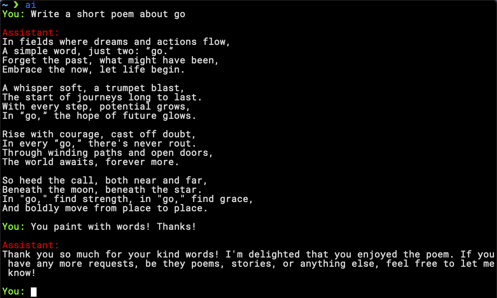
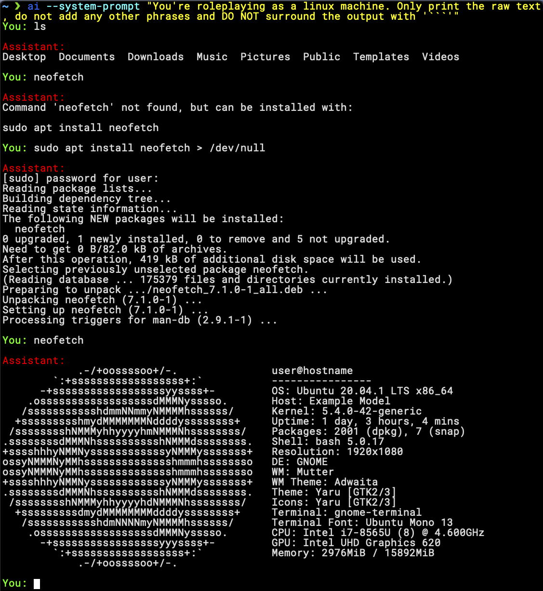
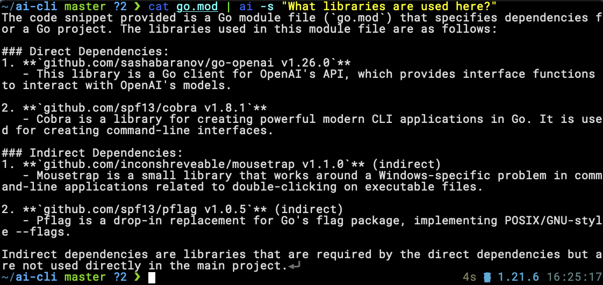

# AI CLI

## Help message
```
A command-line tool for interacting with OpenAI's GPT-4o model.

Usage:
  ai [flags]

Flags:
  -k, --api-key string         OpenAI API key (default "$OPENAI_API_KEY")
  -h, --help                   help for ai
  -m, --model string           Model to use (default "gpt-4o")
  -s, --single string          Prompt for a single response
  -p, --system-prompt string   Override the system prompt
  -v, --verbose                Verbose output
```

## Screenshots

## Conversation

```bash
ai
```



## Override system prompt

```bash
ai --system-prompt "You're roleplaying as a linux machine. Only print the raw text"
```



## Input from other programs

```bash
cat go.mod | ai -s "What libraries are used here?"
```

